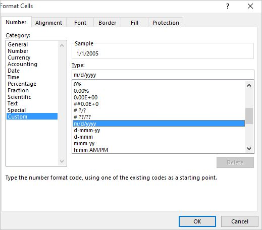
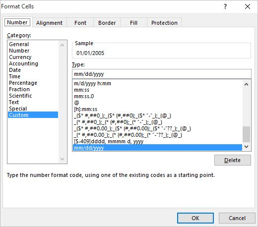

Sometime you get data in Excel in a m/d/yyyy format

Here is an example
   
1/1/2005
2/1/2012
2/12/2012
12/5/2015

This will look fine in Excel but if you need to import this data into a database you might get an error that the format is not correct
What you want is the data to be in this format

01/01/2005
02/01/2012
02/12/2012
12/05/2015

If you use Format Cells and then pick Date you will see that there is no mm/dd/yyyy format

What you have to do is pick the Custom Category and click on the m/d/yyyy format

Now change m/d/yyyy to mm/dd/yyyy

Click OK and you are all set