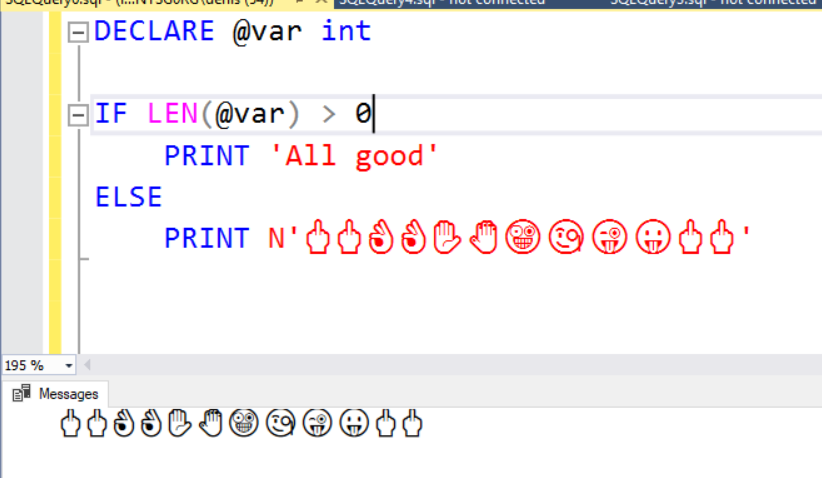

SSMS let's you put emojis in strings. I just tried it out as a joke.

Make sure to put a N in front of the string, this way SSMS knows it's unicode

Run the following block of code in SSMS

```SQL
DECLARE @var int 

IF LEN(@var) > 0
	PRINT 'All good'
ELSE 
	PRINT N'🖕🖕👌👌✋🤚🤪🧐😜😛🖕🖕'
```
Here is what it looks like

Now you can give users a big middle finger instead of an error message :-)


